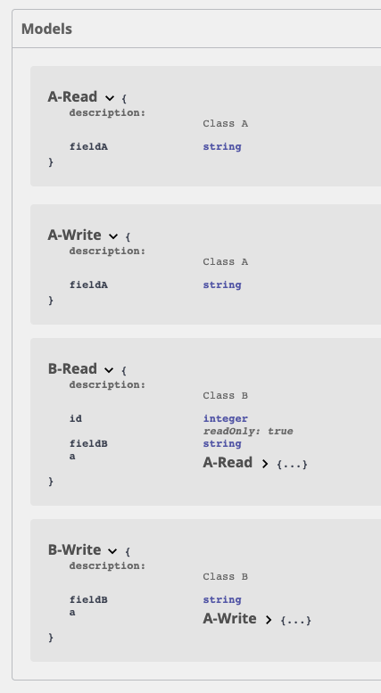

# The problem

```
class A
{

    /**
     * @var string
     *
     * @Groups({"a:read", "a:write", "b:read", "b:write"})
     */
    private $fieldA;

    /**
     * @var B
     *
     * @Groups({"a:read", "a:write"})
     */
    private $b;


class B
{
    /**
     * @var string
     *
     * @Groups({"b:read", "b:write"})
     */
    private $fieldB;

    /**
     * @var A
     *
     * @Groups({"b:read", "b:write"})
     */
    private $a;
```

It's making the READ / WRITE model based on first occurrence. This could be the entity itself (correct) or based on a foreign field (incorrect) with probably less fields.
In the above example it will find process Class B with field $a as first A entity, because the serialization group is 'b:read'/'b:write' it will only include fieldA.



Eventually the output of the API matches the serialization group, the problem is the generated swagger docs on which the SDK is generated.


